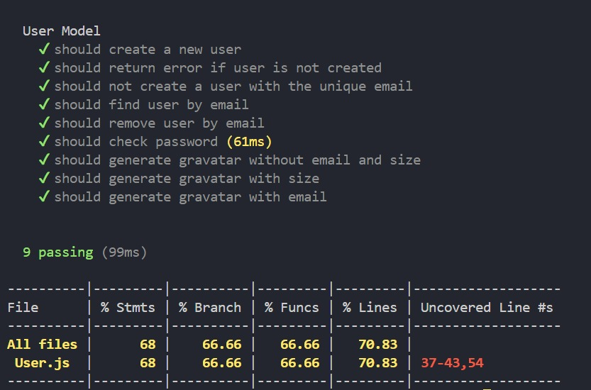

<h1>ES2_2024-2_hackathon-starter</h1>

## > Low code / No code

### Integrantes do Grupo:
👩 github: natycristina, link: https://github.com/natycristina

👩 github: CarolinaMartinsEmilio, link: https://github.com/CarolinaMartinsEmilio

👩 github: akarys2304, link: https://github.com/akarys2304

🧑 github: lgstavo, link: https://github.com/lgstavo

##📊 Testes e Cobertura de Código (código original)

###✅ Testes Executados
User Model
✔️ should create a new user

✔️ should return error if user is not created

✔️ should not create a user with the unique email

✔️ should find user by email

✔️ should remove user by email

✔️ should check password (61ms)

✔️ should generate gravatar without email and size

✔️ should generate gravatar with size

✔️ should generate gravatar with email

🟢 9 testes passando (99ms)

###📊 Cobertura de Código

###📌 Observações
A cobertura de código está 70.83% em termos de linhas.
Algumas linhas não estão cobertas pelos testes (37-43, 54).
Melhorias nos testes podem focar nessas linhas para aumentar a cobertura.
